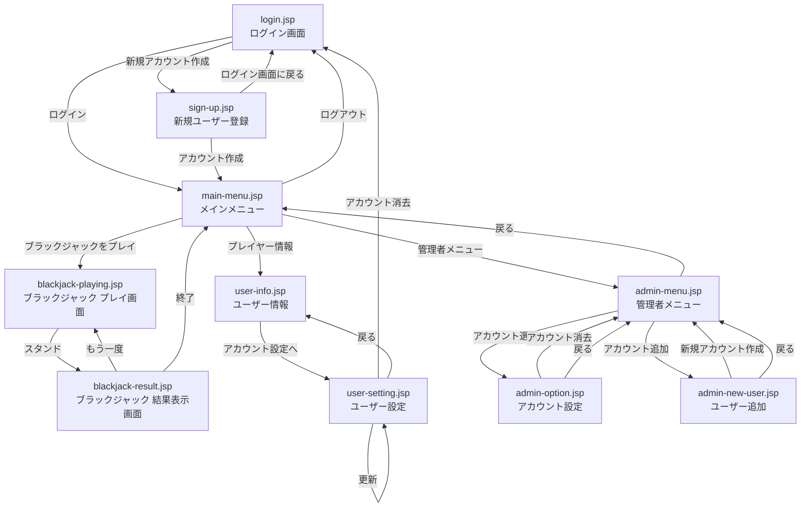

```mermaid
flowchart TD

    %% ログイン関連
    login[login.jsp<br>ログイン画面]
    signup[sign-up.jsp<br>新規ユーザー登録]
    mainmenu[main-menu.jsp<br>メインメニュー]

    %% ブラックジャック
    bjplay[blackjack-playing.jsp<br>ブラックジャック プレイ画面]
    bjresult[blackjack-result.jsp<br>ブラックジャック 結果表示画面]

    %% ユーザー関連
    userinfo[user-info.jsp<br>ユーザー情報]
    usersetting[user-setting.jsp<br>ユーザー設定]

    %% 管理者関連
    adminmenu[admin-menu.jsp<br>管理者メニュー]
    adminoption[admin-option.jsp<br>アカウント設定]
    adminnew[admin-new-user.jsp<br>ユーザー追加]

    %% 遷移定義
    login -->|ログイン| mainmenu
    login -->|新規アカウント作成| signup
    signup -->|アカウント作成| mainmenu
    signup -->|ログイン画面に戻る| login

    mainmenu -->|ログアウト| login
    mainmenu -->|ブラックジャックをプレイ| bjplay
    mainmenu -->|プレイヤー情報| userinfo
    mainmenu -->|管理者メニュー| adminmenu

    bjplay -->|スタンド| bjresult
    bjresult -->|もう一度| bjplay
    bjresult -->|終了| mainmenu

    userinfo -->|アカウント設定へ| usersetting
    usersetting -->|更新| usersetting
    usersetting -->|アカウント消去| login
    usersetting -->|戻る| userinfo

    adminmenu -->|アカウント選択| adminoption
    adminmenu -->|アカウント追加| adminnew
    adminmenu -->|戻る| mainmenu

    adminoption -->|アカウント消去| adminmenu
    adminoption -->|戻る| adminmenu

    adminnew -->|新規アカウント作成| adminmenu
    adminnew -->|戻る| adminmenu
```