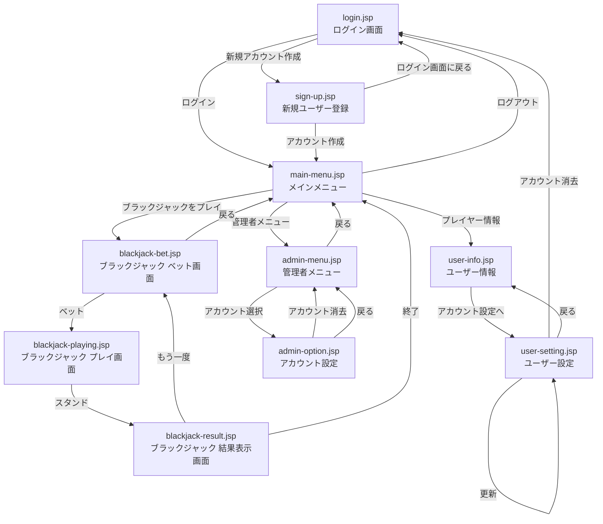

# 画面設計

## 遷移図

---
## login.jsp
**1.1 ログイン画面**
- **目的**: 既存のアカウントにログインする
- **要素**
  - ユーザー名入力欄
  - パスワード入力欄
  - `ログイン`ボタン
  - `新規アカウント作成`ボタン
  - ログアウト後に画面表示 ->「ログアウトしました」
  - アカウント消去後に画面表示 ->「アカウントを削除しました」
- **操作フロー**
  1. ユーザー名を入力する
  2. パスワードを入力する
  3. `ログイン`ボタンを押し、認証する -> [メインメニュー](#main-menujsp)へ移動
  4. アカウントを新しく作る場合、`新規アカウント作成`ボタンを押す ->  [新規ユーザー登録](#sign-upjsp)へ移動
---
## sign-up.jsp
**1.2 新規ユーザー登録**
- **目的**: 新しくユーザーアカウントを作成してログインする
- **要素**
  - ユーザー名入力欄
  - パスワード入力欄
  - `アカウントを作成` ボタン
  - `ログイン画面に戻る` ボタン
- **操作フロー**
  1. ユーザー名を入力する
  2. パスワードを入力する
  3. `アカウント作成` ボタンを押し、アカウントが作成され、そのアカウントにログインする -> [メインメニュー](#main-menujsp)へ移動
  4. ログイン画面に戻るなら、`ログイン画面に戻る` ボタンを押す -> [ログイン画面に戻る](#loginjsp)へ移動
---
## main-menu.jsp
**2 メインメニュー**
- **目的**: メインメニュー・全機能をつなぐハブ
- **要素**
  - `ログアウト` ボタン
  - `ブラックジャックをプレイ` ボタン
  - `ユーザー情報` ボタン
  - *`管理者メニュー` ボタン(権限を持つアカウントにのみ表示)*
- **操作フロー**
  1. ログアウトするときは`ログアウト`ボタンを押す -> [ログイン画面](#loginjsp)へ移動
  2. ブラックジャックをプレイするときは`ブラックジャックをプレイ` ボタンを押す -> [ブラックジャック プレイ画面](#blackjack-playjsp)へ移動
  3. プレイヤー情報を確認したいときは`プレイヤー情報`ボタンを押す -> [プレイヤー情報](#user-infojsp)へ移動
  4. 管理者メニューを開きたいときは、権限を持つアカウントにログインした状態でのみ表示される`管理者メニュー`ボタンを押す -> `AdminOptionController`を使い、[管理者メニュー](#admin-menujsp)へ移動
---
## blackjack-playing.jsp
**3.0 ブラックジャック ベット画面**
- **目的**: 一つのラウンドで賭けるチップの枚数を定める
- **要素**
  - 枚数増減ボタン
  - 枚数カウンタ
  - `ベット`ボタン
  - `もどる`ボタン
- **操作フロー**
  1. プレイヤーは`△` `▽`ボタンを押して、ベットするチップの枚数を決定する
  2. 枚数決定後、`ベット`ボタンを押してゲーム画面へ進む
  3. `戻る`ボタンを押してメインメニューへ戻る
---
**3.1 ブラックジャック プレイ画面**
- **目的**: 現在場に出ているカードの表示と、引くか引かないかの決定
- **要素**
  - ディーラーの手札
  - プレイヤーの手札
  - ディーラーの合計値
  - プレイヤーの合計値
  - `一枚引く` ボタン
  - `スタンド` ボタン
- **操作フロー**
  _プレイヤーはチップを賭ける枚数を選択する(追加要素)_
  1. プレイヤーはカードを見て、追加で一枚引くか、手札を確定させるかを選ぶ
  2. 追加で引く場合、`一枚引く`ボタンを押して手札を一枚追加する
  3. 手札を確定させる場合、`スタンド`ボタンを押して手札を確定させ、[結果表示画面](#blackjack-resultjsp)を表示する
---
## blackjack-result.jsp
**3.2 ブラックジャック 結果表示画面**
- **目的**: ブラックジャックの勝敗を表示する
- **要素**
  - ディーラーの手札
  - プレイヤーの手札
  - ディーラーの合計値
  - プレイヤーの合計値
  - 勝敗表示
  - _チップWIN枚数(追加要素)_
  - `もう一度`ボタン
  - `終了`ボタン
- **操作フロー**
  1. 最終的なディーラーの手札が決定、勝敗が表示される
  _勝敗に応じたチップが加算される(追加要素)_
  2. もう一度プレイする場合、`もう一度`ボタンを押す -> [ブラックジャック プレイ画面](#blackjack-playingjsp)へ移動
  3. プレイを終了する場合、`終了`ボタンを押す -> [メインメニュー](#main-menujsp)へ移動
---
## user-info.jsp
**4.1 ユーザー情報画面**
- **目的**: ユーザーのアカウントに保存されている情報を表示する
- **要素**
  - 戦績表示 何勝何敗何分
  - 全ユーザーの勝率トップ5を表示
  - _所持しているチップ枚数を表示(追加要素)_
  - _所持チップ増減数でランキング付け(追加要素)_
  - `アカウント設定へ`ボタン
- **操作フロー**
  1. アカウントの設定を行う場合、`アカウント設定へ`ボタンを押して[ユーザー設定](#user-settingjsp)へ移動
---
## user-setting.jsp
**4.2 ユーザー設定画面**
- **目的**: ユーザーのアカウントの情報を編集/削除する
- **要素**
  - ユーザー名変更フィールド
  - パスワード入力フィールド
   - ~~新パスワード入力フィールド~~
  - ~~新パスワード確認入力フィールド~~
  - `更新`ボタン
  - `アカウント消去`ボタン
  - `戻る`ボタン
- **操作フロー**
  1. 新しいユーザー名を入力する
  2. 現在のパスワードを入力する
  3. ~~パスワードを新しくする場合は、新しいパスワードを入力フィールドと確認入力フィールドの二箇所に入力する~~
  4. `更新`ボタンを押し、アカウントの情報を更新する -> [ユーザー設定画面](#user-settingjsp)を再度表示
  5. アカウントを消去するなら、`アカウント消去`ボタンを押す -> [ログイン画面](#loginjsp)へ移動
  6. ユーザー情報画面に戻るとき、`戻る`ボタンを押す -> [ユーザー情報画面](#user-infojsp)へ移動
---
## admin-menu.jsp
**5.1 管理者メニュー**
- **目的**: 管理者権限で全アカウントの情報を一覧する
- **要素**
  - 全アカウントの情報
  - `アカウント選択`ボタン
  - `戻る`ボタン
- **操作フロー**
  1. `アカウント選択`ボタンを押して、データを編集するアカウントを選択する -> [アカウント設定画面](#admin-optionjsp)へ移動
  2. メインメニューに戻る場合、`戻る`ボタンを押す -> [メインメニュー](#main-menujsp)へ移動
---
## admin-option.jsp
**5.2 アカウント設定画面**
- **目的**: 管理者権限でアカウントの情報を編集する
- **要素**
  - ユーザー名変更フィールド
  <!-- - 新パスワード入力フィールド
  - 新パスワード確認入力フィールド -->
  - `更新`ボタン
  - `アカウント消去`ボタン
  - `戻る`ボタン
- **操作フロー**
  1. 新しいユーザー名を入力する
  2. パスワードを新しくする場合は、新しいパスワードを入力フィールドと確認入力フィールドの二箇所に入力する
  3. `更新`ボタンを押し、アカウントの情報を更新する
  4. アカウントを消去するなら、`アカウント消去`ボタンを押す -> [管理者メニュー](#admin-menujsp)へ移動
  5. 管理者メニューに戻る場合、`戻る`ボタンを押す -> [管理者メニュー](#admin-menujsp)へ移動

