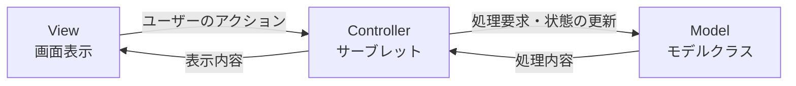
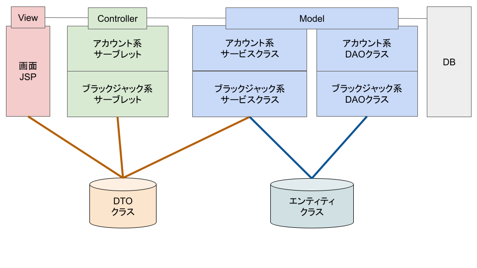

# ブラックジャックアプリ発表資料
#### MVCモデル

```mermaid
flowchart LR

  %% MVCモデルの話
  V[View<br>画面表示]
  C[Controller<br>サーブレット]
  M[Model<br>モデルクラス]

  V -->|ユーザーのアクション| C
  C -->|表示内容| V
  C -->|処理要求・状態の更新| M
  M -->|処理内容| C

```

→ 演習は厳密にクラス分けして実装しよう

---

#### 実習開発のファイル構成

---

#### 開発中に受けた恩恵

実装中、DBテーブルの設計方針を変更 
→変更によるコードへの影響をクラス分けによって吸収 
Modelクラスとエンティティクラスの対応のみで済んだ
